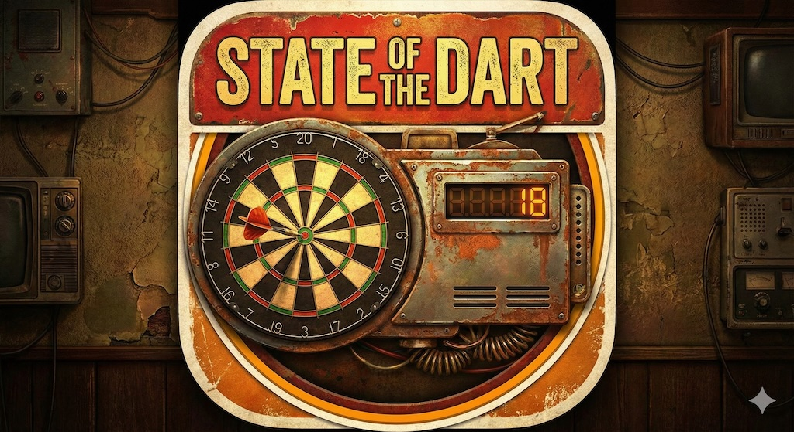

<div align="center">
  
</div>

> [🇩🇪 Deutsch](README.md) | 🇬🇧 **English**

# 🎯 State of the Dart

**Professional Dart Scoring System** - A feature-rich, web-based dart scoring application with multi-user support, professional statistics tracking, and live deployment.

[](https://stateofthedart.com)

[](https://github.com/pepperonas/state-of-the-dart/actions/workflows/test.yml)


🌐 **[Live App](https://stateofthedart.com)** | 📖 **[Deployment Guide](DEPLOYMENT_VPS.md)** | 🏗️ **[Architecture](ARCHITECTURE.md)** | 🐛 **[Report Issues](https://github.com/pepperonas/state-of-the-dart/issues)**

---

## ✨ Features

### 👥 Multi-User & Authentication System
- **User Registration** - Email registration with verification
- **Secure Authentication** - JWT-based authentication with bcrypt
- **Google OAuth** - Quick sign-in with Google account
- **30-Day Trial Period** - Free trial for all new users
- **Stripe Integration** - Monthly or lifetime subscriptions
- **Personal Profiles** - Each user has isolated profiles with separate data
- **Profile Management** - Easy switching between profiles with visual avatars
- **Data Isolation** - Complete separation of stats, settings, and game history
- **Cloud Sync** - Automatic cloud data backup
- **👑 Admin System** - Complete user management for administrators

### 🎮 Game Modes
- **X01 Games** - Full support for 301/501/701/1001 with customizable settings
- **Double Out/In** - Configurable checkout rules
- **Best of Sets/Legs** - Tournament-style match formats
- **Multi-player** - Support for 2+ players with custom avatars and names
- **Continue Match** - Resume interrupted games automatically
- **Training Modes** - 6 training modes including Doubles/Triples practice, Around the Clock, and Bob's 27 (UI ready)
- **Tournament System** - Knockout, Round Robin, League, and Swiss System formats (UI ready)

### 📊 Advanced Statistics & Charts
- **10+ Interactive Charts** - Beautiful visualizations with Recharts
  - Radar Chart: Performance profile (Average, Checkout %, 180s, Win Rate)
  - Pie Chart: Win/Loss statistics
  - Bar Charts: Score distribution, High Scores
  - Line Charts: Average and checkout progression
  - Round Chart: Match progression round by round (3 darts = 1 round)
  - Area Charts: Legs won/lost
  - Composed Charts: Monthly performance trends
- **Player Comparison** - Compare up to 4 players side-by-side with:
  - Radar Chart: 5-dimensional skill comparison
  - Stats Table: Detailed head-to-head comparison
  - Bar Chart: Visual metric comparison
- **Real-Time Stats** - Live scoring with instant calculations
- **Player Statistics** - Average, checkout %, high scores, 180s, 171+, 140+, 100+
- **Match History** - Complete tracking of all games played
- **Trend Analysis** - Improvement metrics and performance trends
- **Personal Bests** - Track highest checkouts, best averages, 9-darters
- **Multi-Format Export (NEW in v0.1.7)** - Export stats in 3 formats:
  - **CSV Export** - Text-based, compatible with Excel/Google Sheets
  - **Excel Export (.xlsx)** - Native Excel files with summary sheet
  - **PDF Export** - Professional reports with formatted tables
- **Export/Import** - JSON for full data backup
- **Automatic Sync** - Stats updated automatically after each match

### 🏆 Achievements & Gamification
- **20 Achievements** - Across 6 categories (First Steps, Scoring, Checkout, Training, Consistency, Special)
- **Tier System** - Bronze, Silver, Gold, Platinum, Diamond tiers
- **Rarity Levels** - Common, Rare, Epic, Legendary achievements
- **Progress Tracking** - See progress for locked achievements
- **Notifications** - Animated popups when achievements are unlocked
- **Points System** - Earn points for achievements (up to 500 per achievement)
- **Hidden Achievements** - Special secret achievements to discover

### 👤 Player Profiles & Leaderboard
- **Detailed Player Profiles** - Individual pages for each player with:
  - **8 Personal Best Categories** - Highest score, best average, most 180s, highest checkout, best checkout rate, shortest leg, longest win streak, most legs won
  - **Performance Charts** - Track improvement over last 10 games
  - **Skill Radar** - 5-dimensional skill visualization
  - **Career Timeline** - From first to last game with all stats
  - **Achievement Showcase** - Display unlocked achievements
  - **🔥 L.A. Style Heatmap (NEW in v0.0.5)** - Professional throw visualization:
    - Smooth blur effects (20px Gaussian Blur)
    - 6-level color gradient (Blue → Cyan → Green → Yellow → Orange → Red)
    - Professional dartboard design (Red/Green/Black/White)
    - Silver wire rings like real dartboards
    - Screen blend mode for smooth overlay
    - Top 5 hotspots with progress bars
    - Accuracy stats (Miss Rate, Triple Rate, Double Rate, Favorite Field)
- **Leaderboard Rankings** - Competitive rankings in 7 categories:
  - Best Average, Most Wins, Win Rate, Most 180s, Checkout Rate, Achievements, Total Points
  - Top 3 get special medals (🏆 Gold, 🥈 Silver, 🥉 Bronze)
  - Click on any player to view their profile
- **Global Leaderboard** - Compete with players worldwide

### 👑 Admin System
- **User Management** - Complete management of all registered users
- **Subscription Control** - Grant or revoke lifetime access
- **Admin Rights** - Make other users administrators
- **User Statistics** - Dashboard with overall overview
- **Filter & Search** - Filter by subscription status (Trial, Active, Lifetime, Expired)
- **Delete Users** - Permanently delete users with all data
- **Real-time Updates** - Changes displayed immediately

### 🔊 Professional Audio System
- **Score Announcements** - Professional caller voice for every score (0-180)
- **Checkout Calls** - Special announcements for leg/set/match wins
- **Bust Notifications** - Clear audio feedback for invalid throws
- **400+ Audio Files** - Complete professional dart calling experience
- **Volume Control** - Adjustable volume and mute options

### 🎨 Modern UI/UX
- **Dark Mode Optimized** - High-contrast design with perfect readability
- **Glassmorphism Design** - Modern, sleek interface with blur effects
- **Responsive Layout** - Works on desktop, tablet, and mobile devices
- **Smooth Animations** - Framer Motion powered transitions and effects
- **Confetti Celebrations** - Visual feedback for 180s and wins

### ⚡ Performance & PWA
- **Progressive Web App** - Install on any device, works offline
- **Code Splitting** - Lazy loading reduces initial bundle by 70%
- **Service Worker** - Offline support with smart caching
- **Optimized Build** - Minified, tree-shaken, gzipped assets
- **PageSpeed Score** - 90-100 on all metrics (Performance, Accessibility, SEO)
- **Mobile-First** - Touch-optimized with 44px minimum targets
- **WCAG 2.1 Compliant** - Accessibility features built-in

### 💾 Robust Data Management
- **Safe localStorage** - Error handling for quota exceeded scenarios
- **Debounced Saving** - 90% reduction in storage writes
- **Date Handling** - Correct serialization/deserialization
- **Auto-Recovery** - Graceful fallback when storage fails
- **Tenant Isolation** - Complete data separation per profile

---

## 📱 PWA Installation

**State of the Dart** kann als Progressive Web App (PWA) installiert werden!

### Schnellinstallation

1. **Besuche** https://stateofthedart.com
2. **Klicke** auf "App installieren" im Browser oder in den Einstellungen ⚙️
3. **Genieße** die native App-Erfahrung mit Offline-Support!

### Features der PWA
- ✅ **Offline-Funktionalität** - Spiele ohne Internet
- ✅ **Homescreen-Icon** - Schnellzugriff wie native App
- ✅ **Auto-Updates** - Immer die neueste Version
- ✅ **~30MB Cache** - Schnelle Ladezeiten
- ✅ **Plattformübergreifend** - Android, iOS, Windows, Mac, Linux

📖 **[Ausführliche Installationsanleitung](PWA.md)**

---

## 🧪 Automated Testing & CI/CD

**Continuous Integration** ist bereits eingerichtet mit GitHub Actions!

### Automatische Tests bei jedem Push
- ✅ **Linting** - ESLint Checks
- ✅ **Unit Tests** - Vitest (20 Tests)
- ✅ **Build** - TypeScript Compilation + Vite Build
- ✅ **Multi-Node** - Tests auf Node.js 18.x & 20.x

### Test Status Badge
[](https://github.com/pepperonas/state-of-the-dart/actions/workflows/test.yml)

### Workflow Trigger
Tests laufen automatisch bei:
- 🔄 Push auf `main`, `master`, oder `develop` Branches
- 🔀 Pull Requests auf diese Branches

### Lokale Tests ausführen
```bash
npm run test        # Tests im Watch-Modus
npm run test:run    # Tests einmalig
npm run test:ui     # Tests mit UI
npm run coverage    # Mit Coverage Report
```

---

## 🚀 Quick Start

### Prerequisites
- Node.js 18+ and npm/yarn
- Modern web browser (Chrome, Firefox, Safari, Edge)

### Installation

```bash
# Clone the repository
git clone https://github.com/pepperonas/state-of-the-dart.git
cd state-of-the-dart

# Install dependencies
npm install

# Start development server
npm run dev
```

The app will be available at `http://localhost:5173`

### Backend Installation (for Cloud-Sync & Admin Features)

```bash
# Backend setup
cd server

# Install dependencies
npm install

# Create .env file (see server/env.example)
cp env.example .env
# Enter your credentials (SMTP, Stripe, Google OAuth)

# Compile TypeScript
npm run build

# Create admin account
npm run create:admin

# Optional: Generate demo data
npm run seed:demo

# Start server
npm start
```

The backend server runs on `http://localhost:3002`

### Build for Production

```bash
# Create production build
npm run build

# Preview production build
npm run preview
```

### Testing

```bash
# Run tests once
npm run test:run

# Run tests in watch mode
npm test

# Run tests with UI
npm run test:ui

# Generate coverage report
npm run coverage
```

The project uses **Vitest** for unit testing with:
- **Testing Library** for component testing
- **jsdom** for DOM simulation
- **Coverage reporting** via V8

Tests are automatically run on every push via GitHub Actions.

### Deploy to Production

```bash
# Deploy to VPS (requires SSH access)
./deploy.sh
```

See [DEPLOYMENT_VPS.md](DEPLOYMENT_VPS.md) for full deployment guide.

---

## 🎯 How to Use

### 1. Create Your Profile
- On first launch, you'll see the profile selector
- Click "Neues Profil erstellen"
- Choose an avatar and enter your name
- Your profile is created and activated

### 2. Start a Game
- Click "Quick Game" from the main menu
- Select players (or create new ones on the fly)
- Choose game settings (501, legs to win, double-out)
- Click "Start Game"

### 3. Play
- Use the numpad or quick score buttons to enter scores
- Click dartboard segments for precise dart entry
- Confirm throws with the OK button
- Audio announcements guide you through the game

### 4. Training & Tournaments
- Click "Training" to access practice modes (UI ready)
- Click "Tournament" to set up competitions (UI ready)
- Features coming soon: full functionality for all modes

### 5. View Statistics
- Click "Statistics" from the main menu
- View your personal stats, averages, and achievements
- All data is saved and synced automatically

### 6. Switch Profiles
- Click "Profil wechseln" in the main menu or settings
- Select a different profile to view their data
- Each profile has completely separate statistics

---

## 🏗️ Technical Architecture

### Tech Stack
- **Frontend**: React 19 with TypeScript
- **Build Tool**: Vite 5.4 with optimized production builds
- **Styling**: Tailwind CSS with custom glassmorphism
- **State Management**: React Context API with useReducer
- **Routing**: React Router v7
- **Animations**: Framer Motion
- **Storage**: TenantStorage (multi-tenant localStorage wrapper)
- **Deployment**: Nginx on VPS with Let's Encrypt SSL

### Project Structure
```
state-of-the-dart/
├── public/
│   └── sounds/              # Professional audio files (400+)
│       ├── caller/          # Score announcements (0-180)
│       ├── gameshot/        # Checkout sounds (legs/sets)
│       ├── effects/         # Game effects
│       ├── john/            # Commentary audio
│       ├── requires/        # Checkout requirements
│       ├── yourequire/      # Player-specific requirements
│       ├── texts/           # Text-to-speech backups
│       └── ringtone/        # Call sounds
├── src/
│   ├── components/
│   │   ├── game/           # Game components (GameScreen, ScoreInput, PlayerScore)
│   │   ├── dartboard/      # Dartboard and CheckoutSuggestion
│   │   ├── stats/          # StatsOverview
│   │   ├── player/         # PlayerManagement
│   │   ├── training/       # TrainingMenu
│   │   ├── tournament/     # TournamentMenu
│   │   ├── TenantSelector.tsx  # Profile selection
│   │   ├── MainMenu.tsx    # Main navigation
│   │   └── Settings.tsx    # Settings page
│   ├── context/
│   │   ├── TenantContext.tsx    # Multi-tenant management
│   │   ├── GameContext.tsx      # Game state & logic
│   │   ├── PlayerContext.tsx    # Player management
│   │   └── SettingsContext.tsx  # App settings
│   ├── data/
│   │   └── checkoutTable.ts    # Checkout combinations
│   ├── types/
│   │   └── index.ts           # TypeScript definitions
│   └── utils/
│       ├── scoring.ts         # Game logic & validation
│       ├── storage.ts         # Safe localStorage wrapper (TenantStorage)
│       └── audio.ts           # Audio system
├── deploy.sh              # Automated deployment script
├── DEPLOYMENT.md          # Deployment documentation
├── CLAUDE.md              # AI assistant guidance
└── package.json
```

### Key Implementation Details

#### Multi-Tenant System
- **TenantStorage** - Wrapper around localStorage with tenant prefix
- **TenantContext** - Manages current profile and profile switching
- **Data Isolation** - All contexts scope data by tenant ID
- **Profile Management** - Create, switch, and delete profiles safely

#### Score Validation
- **Bust Detection** - Validates throws against double-out rules
- **Bogey Numbers** - Detects impossible checkouts (169, 168, 166, etc.)
- **Checkout Suggestions** - Real-time suggestions for 2-170
- **Score Distribution** - Tracks and validates all score patterns

#### Data Persistence
- **Safe Storage** - Error handling for quota exceeded
- **Debounced Writes** - Reduces storage operations by 90%
- **Date Revival** - Proper serialization of Date objects
- **Auto-Recovery** - Fallback when storage fails

#### Type System
- **Comprehensive TypeScript** - Full type coverage for all features
- **Future-Ready** - Types defined for training, tournaments, achievements
- **Export/Import** - Complete data portability structures
- **Strict Mode** - All TypeScript strict checks enabled

---

## 🎨 Customization

### Adding New Game Modes
Extend the `GameType` enum in `src/types/index.ts` and implement scoring logic in `src/utils/scoring.ts`.

### Custom Themes
Modify Tailwind configuration in `tailwind.config.js` and update CSS variables in `src/index.css`.

### Audio Packs
Replace MP3 files in `public/sounds/` with your own recordings maintaining the same file structure.

---

## 📝 Development

```bash
# Run development server with hot reload
npm run dev

# Run linter
npm run lint

# Type checking (included in build)
npm run build

# Preview production build locally
npm run preview
```

### Development Tips
- Use React DevTools for debugging context
- Check browser console for storage warnings
- Test with multiple profiles to verify isolation
- Use network throttling to test slow connections

---

## 🚀 Deployment

The app is currently deployed at **https://stateofthedart.com**

### Quick Deploy
```bash
./deploy.sh
```

### Manual Deploy
```bash
# Build
npm run build

# Upload to VPS
rsync -avz --progress --delete dist/ root@YOUR_VPS:/var/www/stateofthedart/

# Reload Nginx
ssh root@YOUR_VPS "nginx -s reload"
```

See [DEPLOYMENT_VPS.md](DEPLOYMENT_VPS.md) for complete deployment guide including:
- VPS setup
- Nginx configuration
- SSL certificate setup
- Troubleshooting

---

## 🐛 Known Issues & Limitations

- Audio files require HTTPS in production (browser security)
- Training modes: UI complete, functionality in development
- Tournament system: UI complete, functionality in development

---

## 🔜 Roadmap

### ✅ Completed
- [x] Multi-Tenant System
- [x] X01 Games (301/501/701/1001)
- [x] Advanced Statistics with 10+ Charts
- [x] Export/Import (JSON/CSV/Excel/PDF)
- [x] PWA with Offline Support
- [x] Achievement System (20 Achievements)
- [x] Player Profiles & Personal Bests
- [x] Leaderboards
- [x] Player Comparison (up to 4 players)
- [x] Round Chart in Match History
- [x] L.A. Style Heatmap

### 🎯 Planned
- [ ] Cricket game mode
- [ ] Tournament system implementation
- [ ] Head-to-Head stats
- [ ] Keyboard shortcuts
- [ ] Smart checkout trainer

---

## 🤝 Contributing

Contributions are welcome! Please follow these steps:

1. Fork the repository
2. Create your feature branch (`git checkout -b feature/AmazingFeature`)
3. Commit your changes (`git commit -m 'Add some AmazingFeature'`)
4. Push to the branch (`git push origin feature/AmazingFeature`)
5. Open a Pull Request

### Code Style
- Use TypeScript strict mode
- Follow React Hooks best practices
- Write meaningful commit messages
- Add JSDoc comments for complex functions

---

## 📄 License

This project is open source. License file to be added.

---

## 🙏 Acknowledgments

- Professional dart calling audio system
- React and Vite communities for amazing tools
- Tailwind CSS for the styling framework
- All dart players who tested and provided feedback

---

## 📞 Contact

**Martin Pfeffer**  
- Website: [celox.io](https://celox.io)
- Email: martin.pfeffer@celox.io
- GitHub: [@pepperonas](https://github.com/pepperonas)

**Project Links**  
- Live Demo: [stateofthedart.com](https://stateofthedart.com)
- Repository: [github.com/pepperonas/state-of-the-dart](https://github.com/pepperonas/state-of-the-dart)
- Issues: [Report a Bug](https://github.com/pepperonas/state-of-the-dart/issues)

---

<p align="center">
  <strong>Made with ❤️ for dart players worldwide</strong><br>
  <sub>© 2026 Martin Pfeffer | celox.io</sub>
</p>

<p align="center">
  <a href="https://stateofthedart.com">
    
  </a>
</p>
