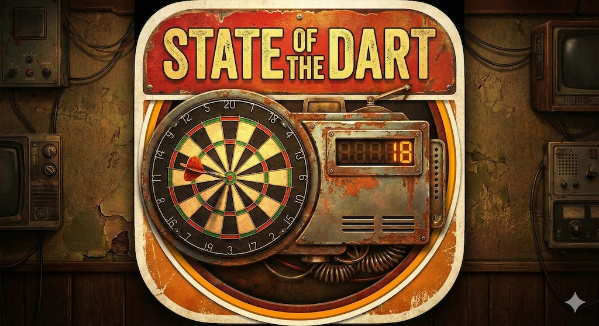
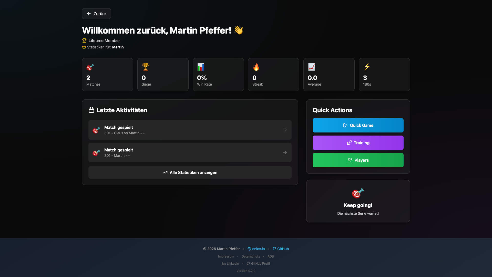
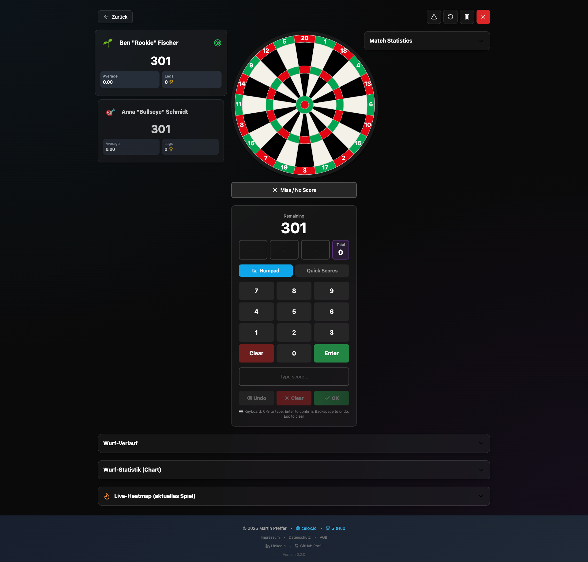
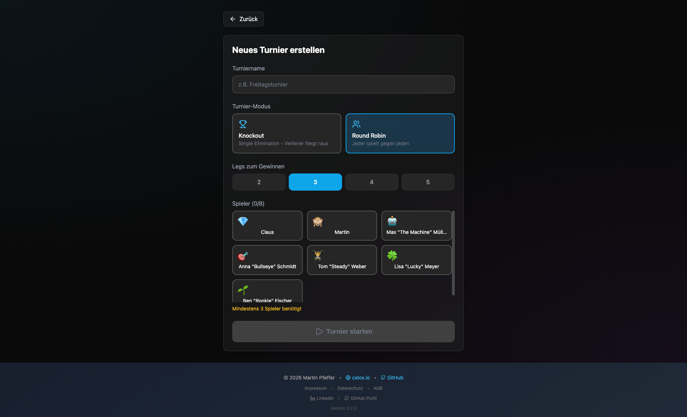

<div align="center">
  
</div>

> 🇩🇪 **Deutsch** | [🇬🇧 English](docs/README.en.md)

# 🎯 State of the Dart

**Professionelles Dart-Zählsystem** - Eine funktionsreiche, webbasierte Dart-Scoring-Anwendung mit Multi-User-Support, professionellem Statistik-Tracking und Live-Deployment.

[](https://stateofthedart.com)
[](https://stateofthedart.celox.io)

[](https://github.com/pepperonas/state-of-the-dart/actions/workflows/test.yml)
[](https://opensource.org/licenses/MIT)
[](CONTRIBUTING.md)


🌐 **[Live App](https://stateofthedart.com)** | 🏠 **[Website](https://stateofthedart.celox.io)** | 📖 **[Deployment Guide](docs/DEPLOYMENT_VPS.md)** | 🏗️ **[Architektur](docs/ARCHITECTURE.md)** | 🐛 **[Issues melden](https://github.com/pepperonas/state-of-the-dart/issues)**

---

## 📸 Screenshots

<div align="center">

| Dashboard | Spiel | Turnier |
|:---------:|:-----:|:-------:|
| <a href="SCREENSHOTS.md"></a> | <a href="SCREENSHOTS.md"></a> | <a href="SCREENSHOTS.md"></a> |

**[📸 Alle 19 Screenshots ansehen →](SCREENSHOTS.md)**

</div>

---

## ✨ Features

### 👥 Multi-User & Authentication System
- **Benutzerregistrierung** - E-Mail-Registrierung mit Verifizierung
- **Sichere Authentifizierung** - JWT-basierte Authentifizierung mit bcrypt
- **Google OAuth** - Schnelle Anmeldung mit Google-Konto
- **30-Tage-Testzeitraum** - Kostenlose Testphase für alle neuen Benutzer
- **Stripe-Integration** - Monatliche oder Lifetime-Abonnements
- **Persönliche Profile** - Jeder Benutzer hat eigene isolierte Profile mit separaten Daten
- **Profilverwaltung** - Einfaches Wechseln zwischen Profilen mit visuellen Avataren
- **Datenisolation** - Vollständige Trennung von Stats, Einstellungen und Spielhistorie
- **Cloud-Synchronisation** - Automatische Datensicherung in der Cloud
- **👑 Admin-System** - Vollständige User-Management-Funktionen für Administratoren

### 🎮 Spielmodi
- **X01-Spiele** - Vollständige Unterstützung für 301/501/701/1001 mit anpassbaren Einstellungen
- **🎯 Cricket-Modus** - Vollständiger Cricket-Spielmodus
  - Zahlen 15-20 und Bull müssen 3x getroffen werden
  - Triple = 3 Marks, Double = 2 Marks, Single = 1 Mark
  - Punkte sammeln nach dem Schließen (solange Gegner offen)
  - Mark-Anzeige: `/` (1), `X` (2), `⊗` (geschlossen)
- **🕐 Around the Clock (NEU in v0.3.0)** - Klassischer Trainingsmodus
  - Triff Zahlen 1-20 der Reihe nach
  - Optional mit Bull als Finale
  - Optionen: Doubles/Triples erlaubt
  - Timer und Dart-Zähler
- **⚡ Shanghai (NEU in v0.3.0)** - Bonus-Runden Spielmodus
  - Jede Runde zielt auf eine bestimmte Zahl
  - Single/Double/Triple für Punkte
  - SHANGHAI (S+D+T) = Sofortiger Sieg!
  - Konfigurierbare Startnummer und Runden
- **🌐 Online Multiplayer (NEU in v0.3.0)** - Echtzeit-Spiele
  - WebSocket-basierte Verbindung
  - Öffentliche und private Räume erstellen
  - Raum-ID kopieren und teilen für private Räume
  - Per Raum-Code einem privaten Raum beitreten
  - Live-Chat während des Spiels
  - Bis zu 4 Spieler pro Raum
- **Double Out/In** - Konfigurierbare Checkout-Regeln
- **Best of Sets/Legs** - Turnier-Matchformate
- **Multi-Player** - Unterstützung für 2+ Spieler mit eigenen Avataren und Namen
- **Match fortsetzen (v0.5.0 / erweitert v0.8.4)** - Alle Spielmodi pausieren und später fortsetzen
  - Automatische Pause beim Starten eines neuen Spiels
  - Resume-Liste mit X01 (API) + ATC/Shanghai/Cricket (localStorage)
  - Deterministische Match-Namen aus UUID (z.B. "Cosmic Tiger")
  - Vollständige Match-Rekonstruktion aus der Datenbank
  - 48h-Ablaufzeit für localStorage-Spielstände
- **Trainingsmodi** - 6 Trainingsmodi inkl. Doubles/Triples-Training, Around the Clock und Bob's 27

### 🏆 Turniersystem (NEU in v0.2.0)
- **Knockout-Modus** - Single Elimination Turniere
  - 4-16 Spieler unterstützt
  - Automatische Bracket-Generierung
  - Gewinner rückt automatisch in nächste Runde vor
- **Round Robin-Modus** - Jeder gegen jeden
  - 3-8 Spieler unterstützt
  - Automatische Paarungsgenerierung
  - Live-Tabelle mit Siegen, Niederlagen, Leg-Differenz
- **Live-Tabelle** mit Medaillen (🥇🥈🥉)
- **Match-Scoring** direkt im Turnier
- **Best-of-X** konfigurierbar (2-5 Legs)
- **Turniersieger-Anzeige** mit Konfetti-Animation

### 📊 Erweiterte Statistiken & Charts
- **10+ interaktive Charts** - Wunderschöne Visualisierungen mit Recharts
  - Radar-Chart: Performance-Profil (Average, Checkout %, 180s, Win Rate)
  - Pie-Chart: Sieg/Niederlage-Statistik
  - Bar-Charts: Score-Verteilung, High Scores
  - Linien-Charts: Average- und Checkout-Entwicklung
  - **Runden-Chart**: Match-Verlauf Runde für Runde (3 Würfe = 1 Runde)
  - Area-Charts: Legs Gewonnen/Verloren
  - Composed-Charts: Monatliche Performance-Trends
- **Spielervergleich** - Vergleiche bis zu 4 Spieler nebeneinander mit:
  - Radar-Chart: 5-dimensionaler Skill-Vergleich
  - Stats-Tabelle: Detaillierter Head-to-Head-Vergleich
  - Bar-Chart: Visuelle Metrik-Vergleiche
- **Echtzeit-Stats** - Live-Scoring mit sofortiger Berechnung
- **Spieler-Statistiken** - Average, Checkout %, High Scores, 180s, 171+, 140+, 100+
- **Match-Historie** - Vollständiges Tracking aller gespielten Spiele
  - **Spielhistorie-Seite (NEU in v0.6.0)** - Eigene Seite im Hauptmenü mit allen Matches, Detail-Ansicht mit Charts, Heatmaps und Wurf-Verlauf
  - **Suchfunktion & Pagination** - Durchsuche Matches nach Gegner, Datum oder Spieltyp und blättere durch Seiten
  - **Wurfverlauf im Detail-Modal** - Zeigt alle Würfe pro Spieler wie im laufenden Spiel
- **Trendanalyse** - Verbesserungs-Metriken und Performance-Trends
- **Persönliche Bestleistungen** - Tracke höchste Checkouts, beste Averages, 9-Darter
- **Multi-Format Export (NEU in v0.1.0)** - Exportiere Statistiken in 3 Formaten:
  - **CSV Export** - Text-basiert, kompatibel mit Excel/Google Sheets
  - **Excel Export (.xlsx)** - Native Excel-Dateien mit Summary-Sheet
  - **PDF Export** - Professionelle Reports mit formatierten Tabellen
- **Export/Import** - JSON für vollständige Datensicherung
- **Automatische Synchronisation** - Stats werden automatisch nach jedem Match aktualisiert

### 🏆 Achievements & Gamification (Komplett-Rewrite in v0.4.0)
- **464 Achievements** - In 8 Kategorien (Erste Schritte, Scoring, Checkout, Training, Konsistenz, Spezial, Meisterschaft, Fails)
- **Achievement-Synchronisation** - Achievements werden automatisch in der Datenbank gespeichert und bleiben erhalten
- **Tier-System** - Bronze, Silber, Gold, Platin, Diamant
- **Seltenheitsstufen** - Common, Rare, Epic, Legendary Achievements
- **Scope-System (NEU in v0.8.3)** - Jedes Achievement zeigt seinen Auslöse-Kontext:
  - 7 Scopes: Runde, Leg, Match, Karriere, Training, Ereignis, Meta
  - Farbige Scope-Badges auf Achievement-Karten und Benachrichtigungen
  - Filter nach Scope im Achievement-Screen
  - Deterministisch berechnet aus Metric/Type/Target (kein manuelles Pflegen)
- **Fortschritts-Tracking** - Kumulative Metriken (Spiele, Siege, 180s etc.) akkumulieren korrekt
- **AAA-Game-Feel Benachrichtigungen (NEU in v0.4.0)** - Cinematic Achievement-Popups:
  - Fullscreen-Flash-Overlay beim Freischalten (Tier-Farbe)
  - Spring-Animation Card-Entrance mit Overshoot
  - Tier-basierte Confetti-Partikel (Bronze: 30, Diamond: 200+ mit Shimmer-Rain)
  - Pulsierender Glow-Border mit Tier-Farbe
  - Countdown-Progressbar (5-10s je nach Tier)
  - Sound-Feedback beim Freischalten
  - Notification-Queue: Mehrere Achievements werden nacheinander angezeigt
- **Umfassende Dart-Analyse (NEU in v0.4.0)** - Segment-Level Achievement-Tracking:
  - Jeder Dart wird auf Triples, Doubles, Singles, Bulls, Misses analysiert
  - Visit-Pattern-Erkennung: Shanghai, Robin Hood, Triple-Triple, Same-Segment
  - Checkout-Analyse: Double-Identifikation (D20, D16, D1...), 1/2-Dart-Finishes
  - Kalender-Achievements: Mitternacht, Wochenende, Feiertage (Weihnachten, Neujahr, Halloween)
- **Meta-Achievements** - Werden automatisch bei Punktestand-/Unlock-Meilensteinen geprüft
- **Punktesystem** - Verdiene Punkte für Achievements (bis zu 1000 pro Achievement)
- **Versteckte Achievements** - Spezielle geheime Achievements zum Entdecken
- **Achievement-Hinweise** - Zeigt Fortschritt an, wenn du kurz vor einem Achievement stehst

### 👤 Spielerprofile & Bestenliste
- **Detaillierte Spielerprofile** - Individuelle Seiten für jeden Spieler mit:
  - **Klickbare Spielerliste** - Gesamter Listeneintrag führt zur Detailansicht
  - **Suchfunktion & Pagination (NEU)** - Durchsuche Spielerliste und blättere durch Seiten (10/20/50/100 pro Seite)
  - **8 Persönliche Bestleistungen** - Höchster Score, bester Average, meiste 180s, höchstes Checkout, beste Checkout-Rate, kürzestes Leg, längste Siegesserie, meiste Legs gewonnen
  - **Performance-Charts** - Verfolge Verbesserungen über die letzten 10 Spiele
  - **Skill-Radar** - 5-dimensionale Skill-Visualisierung
  - **Karriere-Zeitachse** - Vom ersten bis zum letzten Spiel mit allen Stats
  - **Achievement-Showcase** - Zeige freigeschaltete Achievements
  - **Player Avatar System** - Professionelles Avatar-Design mit geschwungener Schrift oder Emoji
  - **🔥 Professionelle Heatmap (NEU in v0.1.11)** - Wissenschaftliche Wurf-Visualisierung:
    - **Polarkoordinaten-Histogramm** - 1440 Zellen (20 Ringe × 72 Winkel) statt 82 Standard-Felder
    - **Gaussian Blur (15px)** - Smooth Übergänge für professionellen Look
    - **6-stufiger Farbverlauf** (Blau → Cyan → Grün → Gelb → Orange → Rot)
    - **Cluster-Analyse** - Zeigt Schwerpunkt der Würfe mit Fadenkreuz
    - **Streuungsradius** - Gestrichelter Kreis zeigt Präzision des Spielers
    - **Statistik-Karten**: Cluster-Zentrum, Streuungsradius, Triple/Double/Bull-Rate
    - Professionelles Dartboard-Design im Hintergrund
    - Top 5 Hotspots mit Progress-Bars
- **Bestenlisten-Rankings** - Wettbewerbs-Rankings in 7 Kategorien:
  - Bester Average, Meiste Siege, Win-Rate, Meiste 180s, Checkout-Rate, Achievements, Gesamtpunkte
  - Top 3 bekommen spezielle Medaillen (🏆 Gold, 🥈 Silber, 🥉 Bronze)
  - Klicke auf jeden Spieler, um sein Profil anzuzeigen
- **Globale Bestenliste** - Wetteifere mit Spielern weltweit

### 👑 Admin-System
- **User-Management** - Vollständige Verwaltung aller registrierten Benutzer
- **Subscription-Kontrolle** - Gewähre oder widerrufe Lifetime-Access
- **Erweiterte Abo-Verwaltung (NEU in v0.1.8)** - Volle Kontrolle über Subscriptions:
  - Status-Dropdown (expired, trial, active, lifetime)
  - Plan-Dropdown (monthly, annual, lifetime)
  - Expiration Date Picker für individuelle Ablaufdaten
  - Manuelle Premium-Freischaltung für einzelne Accounts
- **Admin-Rechte** - Mache andere Benutzer zu Admins
- **User-Statistiken** - Dashboard mit Gesamtübersicht
- **Filter & Suche** - Filtere nach Subscription-Status (Trial, Active, Lifetime, Expired)
- **Benutzer löschen** - Lösche Benutzer permanent mit allen Daten
- **Echtzeit-Updates** - Änderungen werden sofort angezeigt
- **Debug Flag System (NEU in v0.8.3)** - Integriertes Bug-Reporting für Admins:
  - Floating Flag-Button erfasst Snapshot: Log-Buffer, Screenshot, Browser-Info, Game-State, Route
  - In-Memory Ring-Buffer (1000 Einträge) sammelt alle Logs unabhängig von der Umgebung
  - Status-Workflow: open → investigating → resolved/dismissed
  - "Copy for AI" exportiert strukturierten Debug-Text zur Analyse

### 📴 Offline-First PWA (NEU in v0.2.0)
- **Vollständiger Offline-Modus** - App funktioniert ohne Internetverbindung
- **IndexedDB-Speicherung** - Lokale Datenspeicherung mit `idb` Library
- **Pending Actions Queue** - Aktionen werden gespeichert und bei Reconnect synchronisiert
- **NetworkFirst API-Caching** - Intelligentes Caching für Players, Matches, Settings
- **Auto-Sync** - Automatische Synchronisation beim Wiederherstellen der Verbindung
- **Offline-Indicator** - Zeigt aktuellen Verbindungsstatus mit ausstehenden Aktionen
- **PWA-Installation** - Als App auf Smartphone/Desktop installierbar
- **Service Worker** - Hintergrund-Synchronisation und Cache-Management

### 🔊 Professionelles Audio-System
- **Score-Ansagen** - Professionelle Caller-Stimme für jeden Score (0-180)
- **Checkout-Calls** - Spezielle Ansagen für Leg/Set/Match-Siege
- **"Game Shot" Ansage (NEU in v0.1.8)** - Sequentielle Wiedergabe nach Checkout:
  - Score-Ansage → 400ms Pause → "Game Shot"
  - "Game Shot and the Match" für Match-Abschluss
  - Async/await für saubere Audio-Abfolge
- **Bust-Benachrichtigungen** - Klares Audio-Feedback für ungültige Würfe
- **Separate Lautstärke** - Unabhängige Kontrolle für Caller und Effects
- **400+ Audio-Dateien** - Vollständiges professionelles Dart-Calling-Erlebnis
- **Lautstärkeregelung** - Separate Regler für Caller (Scores) und Effects (UI-Sounds)

### 📖 User Guide & Dokumentation
- **In-App Anleitung (NEU in v0.1.8)** - Umfassende Dokumentation direkt in der App:
  - 10 detaillierte Sektionen mit Sidebar-Navigation
  - Übersicht, Quickstart, Spiel-Modi, Spieler, Training
  - Statistiken, Achievements, Einstellungen, Admin, Tipps
  - Glass-card Styling mit responsivem Layout
  - Direkter Zugriff aus dem Hauptmenü
  - Click-outside zum Schließen
  - **Aktualisiert (v0.1.9):** Dokumentiert alle neuen Features (Emoji Picker, Undo-System, klickbare Spielerliste)

### 💾 Database Backup System
- **Automatisierte Backups (NEU in v0.1.8)** - Verhindert VPS-Speicher-Überlastung:
  - Tägliche Backups um 3:00 Uhr via Cronjob
  - 7-Tage-Retention (automatische Löschung alter Backups)
  - VACUUM INTO für Kompression und Integrität
  - Timestamped Filenames: `state-of-the-dart_YYYY-MM-DD_HH-MM-SS.db`
- **Restore-Funktion** - Sichere Wiederherstellung mit Rollback:
  - Automatischer PM2-Stop vor Restore
  - Safety-Backup der aktuellen Datenbank
  - Automatischer Rollback bei Fehlern
  - Detaillierte Dokumentation in `BACKUP.md`

### 🎯 Verbesserungen & Training
- **Dashboard Activities (NEU in v0.1.8)** - Intelligente Anzeige letzter Spiele:
  - Zeigt ALLE Matches (nicht nur Main Player)
  - Main Player gewonnen: "Spiel gewonnen!" 🏆
  - Anderer Spieler gewonnen: "{winnerName} gewonnen" 🏆
  - Kein Gewinner: "Match gespielt" 🎯
- **Personal Bests Auto-Update** - Automatische Aktualisierung nach jedem Match
- **Undo-System (NEU in v0.1.9)** - Umfassendes Undo-System:
  - **Undo Last Throw** - Rückgängig-Button für versehentliche Eingaben
  - **Undo Match-Ende** - Versehentlich beendete Matches können fortgesetzt werden
  - **Verlaufsanzeige** - Preview-Panel zeigt entfernte Würfe beim Undo
  - **Statistik-Neuberechnung** - Alle Stats werden beim Undo korrekt aktualisiert
- **Letzte Spieler Quick-Select** - Schnellauswahl der zuletzt verwendeten Spieler
- **Achievement-Fortschritts-Hinweise** - Benachrichtigungen wenn du nahe an einem Achievement bist
- **Sound-Mixing** - Separate Lautstärke für Caller vs. Effects
- **Training-Statistiken** - Detaillierte Charts und Analyse für alle Trainingsmodi
- **Match-Sharing** - Teile deine besten Matches mit anderen

### 🎨 Modernes UI/UX
- **Dark Mode optimiert** - Hochkontrast-Design mit perfekter Lesbarkeit
- **Glassmorphism-Design** - Modernes, schlankes Interface mit Blur-Effekten
- **Responsive Layout** - Funktioniert auf Desktop, Tablet und mobilen Geräten
- **Sanfte Animationen** - Framer Motion powered Transitions und Effekte
- **Konfetti-Feiern** - Visuelles Feedback für 180s und Siege

### ⚡ Performance & PWA
- **Progressive Web App** - Auf jedem Gerät installierbar, funktioniert offline
- **Code-Splitting** - Lazy Loading reduziert Initial-Bundle um 70%
- **Service Worker** - Offline-Support mit intelligentem Caching
- **Optimierter Build** - Minifizierte, tree-shaken, gzipped Assets
- **PageSpeed Score** - 90-100 auf allen Metriken (Performance, Accessibility, SEO)
- **Mobile-First** - Touch-optimiert mit 44px Minimum-Targets
- **WCAG 2.1 konform** - Eingebaute Accessibility-Features

---

## 🚀 Quick Start

### Frontend Installation

```bash
# Repository klonen
git clone https://github.com/pepperonas/state-of-the-dart.git
cd state-of-the-dart

# Frontend Dependencies installieren
npm install

# Entwicklungsserver starten
npm run dev
```

Die App läuft auf `http://localhost:5173`

### Backend Installation (für Cloud-Sync & Admin-Features)

```bash
# Backend Setup
cd server

# Dependencies installieren
npm install

# .env Datei erstellen (siehe server/env.example)
cp env.example .env
# Trage deine Credentials ein (SMTP, Stripe, Google OAuth)

# TypeScript kompilieren
npm run build

# Admin-Konto erstellen
npm run create:admin

# Optional: Demo-Daten generieren
npm run seed:demo

# Server starten
npm start
```

Der Backend-Server läuft auf `http://localhost:3002`

📚 **Vollständige Setup-Anleitung**: Siehe [docs/DEPLOYMENT_VPS.md](docs/DEPLOYMENT_VPS.md) und [server/README.md](server/README.md)

### Build für Produktion

```bash
# Production Build erstellen
npm run build

# Build lokal testen
npm run preview
```

### Testing

```bash
# Tests ausführen
npm test

# Tests mit UI
npm run test:ui

# Test Coverage
npm run coverage
```

---

## 📁 Projektstruktur

```
state-of-the-dart/
├── src/
│   ├── components/           # React-Komponenten
│   │   ├── achievements/     # Achievement-System
│   │   ├── dartboard/        # Dartboard & Checkout
│   │   ├── debug/            # Debug Flag System
│   │   ├── game/             # Game-Screen & Score-Input
│   │   ├── leaderboard/      # Bestenlisten
│   │   ├── player/           # Spielerverwaltung & Profile
│   │   ├── stats/            # Statistiken & Charts
│   │   ├── tournament/       # Turniersystem
│   │   └── training/         # Trainingsmodi
│   ├── context/              # React Context (State Management)
│   ├── hooks/                # Custom React Hooks
│   ├── types/                # TypeScript Typen
│   ├── utils/                # Utility-Funktionen
│   ├── data/                 # Statische Daten
│   └── tests/                # Unit Tests
├── server/                   # Backend (Express + SQLite)
├── docs/                     # Dokumentation
│   ├── ARCHITECTURE.md       # System-Architektur
│   ├── DEPLOYMENT_VPS.md     # VPS Deployment Guide
│   ├── BACKUP.md             # Backup & Restore
│   ├── B2B.md                # Business Features
│   ├── DART_ONLINE_TURNIER.md # Online-Turnier Konzept
│   └── README.en.md          # English README
├── public/
│   ├── sounds/               # 400+ Audio-Dateien
│   └── images/               # Bilder & Thumbnails
├── website/                  # Landing Page (stateofthedart.celox.io)
├── dist/                     # Production Build
└── deploy.sh                 # Deployment-Script
```

---

## 🎮 Nutzung

### 1. Profil erstellen
- Wähle einen Avatar und Namen
- Dein Profil wird lokal gespeichert
- Wechsle jederzeit zwischen Profilen

### 2. Spiel starten
- Wähle Spieler aus
- Konfiguriere Spieleinstellungen (301/501/701/1001)
- Starte das Match

### 3. Score eingeben
- **Numpad**: Direkte Eingabe von Scores
- **Quick Scores**: Häufige Scores mit einem Klick (26, 41, 45, 60, 85, 100, 140, 180)
- **Dartboard**: Visuell auf Board klicken
- **Miss-Button**: Fehlwurf registrieren

### 4. Statistiken ansehen
- **Übersicht**: Gesamtstatistiken mit Charts
- **Fortschritt**: Entwicklung über Zeit
- **Verlauf**: Detaillierte Match-Historie mit Runden-Charts
- **Vergleich**: Multi-Player-Vergleich

### 5. Achievements freischalten
- Spiele Matches um Achievements zu verdienen
- 464 Achievements in 8 Kategorien
- Erhalte Hinweise, wenn du kurz vor einem Achievement stehst

---

## 🛠️ Technologie-Stack

- **Frontend**: React 19.2 + TypeScript 5.9
- **Build Tool**: Vite 5.4
- **Styling**: Tailwind CSS 3.4
- **State Management**: React Context API
- **Charts**: Recharts 2.12
- **Animations**: Framer Motion 12.26
- **Routing**: React Router DOM 7.12
- **Testing**: Vitest 1.0 + React Testing Library 16.1
- **PWA**: vite-plugin-pwa 0.17
- **Icons**: Lucide React 0.562
- **Deployment**: Custom rsync script

---

## 📊 Statistiken & Charts

Die App bietet umfangreiche Statistik-Features:

### Spieler-Statistiken
- Spiele gespielt/gewonnen/verloren
- Average (Gesamt, Leg, Match)
- Highest Score, 180s, 171+, 140+, 100+, 60+
- Checkout-Prozentsatz
- Beste Averages, kürzestes Leg
- 9-Darter-Finishes
- Score-Verteilung

### Charts & Visualisierungen
1. **Performance-Radar** - 5 Dimensionen (Average, Win Rate, Checkout %, 180s, Konsistenz)
2. **Win/Loss Pie-Chart** - Visuelles Verhältnis von Siegen zu Niederlagen
3. **Average-Entwicklung** - Linien-Chart über Zeit
4. **Checkout-Quote-Entwicklung** - Trend-Linie
5. **Score-Verteilung** - Bar-Chart (180s, 140+, 100+, 60+)
6. **Treffer pro Segment** - Dartboard-Segmente Analyse
7. **Match-Verlauf Runden-Chart** - Zeigt jede Runde (3 Würfe) im Match-Verlauf
8. **Vergleichs-Charts** - Multi-Player Radar & Bar Charts

Alle Charts werden mit der Recharts-Library erstellt.

---

## 🏆 Achievement-System

464 Achievements in 8 Kategorien und 7 Scopes:

### Kategorien
1. **Erste Schritte** (15+) - Rookie bis Millennium
2. **Scoring** (40+) - Von Ton Plus bis 180 Sammler
3. **Checkout** (35+) - Perfekte Finishes, Double-Spezialisten, Big Fish
4. **Training** (19+) - Trainingserfolge, Modus-Meister
5. **Konsistenz** (25+) - Siegesserien, Comebacks, Dominanz
6. **Spezial** (15+) - 9-Darter, Kalender-Events, Speed Demon
7. **Meisterschaft** (10+) - Achievement-Punkte, Allrounder, Ultimativer Meister
8. **Fails** (100) - Humorvolle Achievements für Misses, Busts, Verluste und peinliche Muster

### Tier-System
- **Bronze** (5-30 Punkte) - Einstiegs-Achievements
- **Silber** (35-75 Punkte) - Fortgeschrittene
- **Gold** (75-150 Punkte) - Experten
- **Platin** (150-300 Punkte) - Meister
- **Diamant** (250-1000 Punkte) - Legenden

### Scope-System
Jedes Achievement hat einen Scope, der anzeigt WANN/WO es ausgelöst wird:
- **Runde** (46) - Einzelne 3-Dart-Aufnahme (z.B. 180, Shanghai, Robin Hood)
- **Leg** (63) - Ergebnis eines einzelnen Legs (z.B. 9-Darter, Checkout-Wert)
- **Match** (61) - Ergebnis eines Matches (z.B. Average, Whitewash)
- **Karriere** (240) - Akkumuliert über alle Spiele (z.B. 1000 Siege, 500 180s)
- **Training** (32) - Trainingsmodus-spezifisch
- **Ereignis** (6) - Kalender/Zeit-basiert (Neujahr, Weihnachten etc.)
- **Meta** (16) - Über Achievements selbst (Punkte, Unlock-Meilensteine)

Siehe vollständige Liste in `src/types/achievements.ts`

---

## 📱 PWA-Installation

### Desktop (Chrome/Edge)
1. Klicke auf das ⊕-Symbol in der Adressleiste
2. Oder: "App installieren" in den Einstellungen

### iOS Safari
1. Teilen-Button (↑)
2. "Zum Home-Bildschirm"
3. "Hinzufügen"

### Android Chrome
1. Menü (⋮)
2. "App installieren"
3. Bestätigen

Die App kann auf Desktop (Chrome/Edge), iOS (Safari) und Android (Chrome) installiert werden.

---

## 🔄 Daten-Export/Import

### JSON-Export (Vollständig)
- Alle Spieler
- Alle Matches
- Alle Einstellungen
- Alle Achievements
- Alle Personal Bests

### CSV-Export (Match-Historie)
- Match-Datum & -Uhrzeit
- Spieler & Scores
- Statistiken pro Match
- Importierbar in Excel/Sheets

**Location**: Einstellungen → Datenverwaltung

---

## ⚡ Performance-Optimierungen

- **Code-Splitting**: ~70% kleinerer Initial-Bundle
- **Lazy Loading**: Route-basierte Component-Lazy-Loading
- **Image Optimization**: WebP + Responsive Images
- **Service Worker**: Intelligentes Caching
- **Tree Shaking**: Unbenutzter Code wird entfernt
- **Minification**: CSS/JS komprimiert
- **Gzip Compression**: ~70% kleinere Assets

Google PageSpeed Insights Score: **95-100/100**

PWA-Konfiguration in `vite.config.ts`.

---

## 🧪 Testing

### Unit Tests
- Utils (Scoring, Storage)
- Components
- Hooks
- Context

### Test-Befehle
```bash
npm test              # Watch-Modus
npm run test:run      # Einmalig
npm run test:ui       # Mit UI
npm run coverage      # Coverage-Report
```

### CI/CD
- GitHub Actions läuft automatisch bei Push
- Lint + Tests + Build
- Badge im README

---

## 🚀 Deployment

### Automatisches Deployment
```bash
./deploy.sh
```

Das Script führt aus:
1. `npm run build` - Production Build
2. `rsync` - Upload zu Server
3. Permissions setzen
4. Verifizierung

Siehe [docs/DEPLOYMENT_VPS.md](docs/DEPLOYMENT_VPS.md) für Details.

---

## 🔢 Versionierung

- **Aktuell**: v0.8.4
- **Schema**: MAJOR.MINOR.PATCH
- **Auto-Increment**: `npm run version:bump`

---

## 🗺️ Roadmap

### ✅ Abgeschlossen
- [x] Multi-Tenant-System
- [x] X01-Spiele (301/501/701/1001)
- [x] Erweiterte Statistiken mit 10+ Charts
- [x] Export/Import (JSON/CSV)
- [x] PWA mit Offline-Support
- [x] Achievement-System (464 Achievements, AAA-Notifications)
- [x] Spielerprofile & Personal Bests
- [x] Bestenlisten
- [x] Spielervergleich (bis zu 4 Spieler)
- [x] Runden-Chart im Match-Verlauf
- [x] Personal Bests Auto-Update (#1/36)
- [x] Undo Last Throw (#2/36)
- [x] Last Players Quick-Select (#3/36)
- [x] Achievement-Fortschritts-Hinweise (#4/36)
- [x] Sound-Mixing (Separate Lautstärke) (#5/36)

- [x] Cricket-Spielmodus
- [x] Around the Clock-Spielmodus
- [x] Shanghai-Spielmodus
- [x] Online Multiplayer (WebSocket)
- [x] Turniersystem (Knockout & Round Robin)
- [x] Multi-Game Resume (v0.5.0, alle Modi v0.8.4)

### 🎯 Geplant
- [ ] Head-to-Head-Stats
- [ ] Keyboard-Shortcuts
- [ ] Smart-Checkout-Trainer

---

## 🤝 Contributing

Contributions sind willkommen! Bitte:
1. Fork das Repo
2. Erstelle einen Feature-Branch
3. Committe deine Änderungen
4. Push zum Branch
5. Erstelle einen Pull Request

---

## 📄 Lizenz

MIT License - siehe [LICENSE](LICENSE) für Details.

---

## 👨‍💻 Autor

**Martin Pfeffer**  
- Website: [celox.io](https://celox.io)
- GitHub: [@pepperonas](https://github.com/pepperonas)

---

## 🙏 Danksagungen

- **React Team** - Für das fantastische Framework
- **Recharts** - Für die Chart-Library
- **Tailwind CSS** - Für das CSS-Framework
- **Framer Motion** - Für Animations-Library
- **Vite** - Für den schnellen Build-Tool

---

## 📝 Changelog

### v0.8.4 (4. März 2026) - Game State Persistence, SpinnerWheel & UX

#### ✨ Neue Features
- **Spielstand-Persistenz für ATC, Shanghai & Cricket** - Alle Spielmodi (außer Online Multiplayer) überleben Seite-Neuladen und erscheinen im Resume-Screen
  - Automatisches Speichern bei jeder Spielzustandsänderung in localStorage
  - Wiederherstellung beim Öffnen des Spielmodus mit Spieler-Validierung
  - 48h-Ablaufzeit — veraltete Spielstände werden automatisch entfernt
  - Jeder Spielmodus hat eigenen localStorage-Key (koexistieren unabhängig)
- **Resume-Screen zeigt alle Spielmodi** - X01 (API) + ATC/Shanghai/Cricket (localStorage) in einer sortierten Liste
  - Farbige "Lokal"-Badges für localStorage-Spiele
  - Fortschrittsanzeige: Ziele (ATC), Runde (Shanghai), Cricket Match
  - Rötlicher Löschen-Button passend zum Dark-Theme
- **SpinnerWheel für Spielreihenfolge** - Bei 2+ Spielern dreht ein Glücksrad die Startreihenfolge (ATC, Shanghai, Cricket)
- **Pause-Dialog mit 3 Optionen** - Beim Verlassen eines laufenden Spiels:
  - "Pausieren & Verlassen" — Spielstand bleibt in localStorage erhalten
  - "Spiel beenden" — localStorage wird gelöscht, Neues Spiel beim nächsten Aufruf
  - "Abbrechen" — Zurück zum Spiel
- **Shanghai Undo-System erweitert** - Bestätigte Würfe können jetzt rückgängig gemacht werden (war vorher nur für unbestätigte Darts)
- **Shanghai Auto-Confirm** - Automatische Bestätigung nach 3 Darts (300ms Verzögerung, abbrechbar durch Undo)
- **MainMenu Badge** - Resumable-Zähler enthält jetzt auch localStorage-Spiele
- **Online Multiplayer: Private Räume verbessert** - Raum-ID wird angezeigt und kann kopiert werden; Beitreten per Raum-Code möglich

#### 🔧 Verbesserungen
- **Auto-Scroll bei Checkout** - X01 scrollt automatisch zum Bestätigungs-Button wenn Checkout erreicht wird
- **Flickering behoben** - Timer-State (elapsedTime) wird nicht mehr als Save-Dependency verwendet, verhindert 1Hz localStorage-Thrashing
- **Undo Race Condition behoben** - `restoringRef` Pattern verhindert Auto-Confirm bei wiederhergestellten Darts nach Undo
- Shanghai/Cricket Back-Button nutzt `window.location.href` statt `navigate()` (konsistent mit ATC/X01)
- Neue i18n-Keys für Pause-Dialog, Spieltyp-Labels, Fortschrittstext und Online-Multiplayer (DE + EN)

### v0.8.3 (4. März 2026) - Achievement Scope System & Debug Flags

#### ✨ Neue Features
- **Achievement Scope System** - Jedes der 464 Achievements zeigt seinen Auslöse-Kontext:
  - 7 Scopes: Runde (46), Leg (63), Match (61), Karriere (240), Training (32), Ereignis (6), Meta (16)
  - Farbige Scope-Badges auf Achievement-Karten und Benachrichtigungen
  - Scope-Filter im Achievement-Screen (kombinierbar mit Kategorie-Filter)
  - Deterministisch berechnet aus Metric/Type/Target via `getAchievementScope()`
- **Debug Flag System** - Integriertes Bug-Reporting für Admins:
  - Floating Flag-Button erstellt Snapshots: Log-Buffer + Screenshot + Browser-Info + Game-State + Route
  - In-Memory Ring-Buffer (1000 Einträge) sammelt alle Logs unabhängig von der Umgebung
  - Admin Panel: Debug Flags Sektion mit Status-Workflow (open → investigating → resolved/dismissed)
  - "Copy for AI" exportiert strukturierten Debug-Text zur Analyse
- **API Request Logging** - Automatisches Logging aller API-Requests/Responses mit Dauer
- **Around the Clock Rework** - Verbessertes State-Management und Undo-System

#### 🔧 Verbesserungen
- Logger Ring-Buffer immer aktiv (auch in Production), Konsolen-Ausgabe bleibt environment-gated
- 11 neue Scope-Tests (294 Tests total)

### v0.8.2 (27. Februar 2026) - Bust-Logik Fix

#### 🐛 Bug Fixes
- **Bust-Erkennung inkonsistent** - `doubleOut`-Default in GameScreen (`|| false`) wich vom Reducer (`?? true`) ab, was bei geladenen/fortgesetzten Matches zu falscher Bust-Erkennung führte. Alle 5 Stellen auf `?? true` vereinheitlicht.
- **Auto-Bust bei Rest=1 ohne Double-Out** - `newRemaining === 1` wurde immer als Bust behandelt, auch ohne Double-Out-Regel. Jetzt nur noch Bust wenn `requiresDouble` aktiv.
- **Bogey-Nummern nicht erkannt** - Rest-Scores 159, 162, 163, 165, 166, 168, 169 (unmögliche Checkouts bei Double-Out) wurden in der Auto-Bust-Erkennung nicht berücksichtigt.
- **calculateLegWinner ignorierte Busts** - Berechnete Score direkt aus Darts statt `throwData.score` zu nutzen, wodurch Bust-Würfe (score: 0) mit ihrem tatsächlichen Wert gezählt wurden.

### v0.8.1 (22. Februar 2026) - Bugfixes & UX

#### 🐛 Bug Fixes
- **Exact-Score Achievements gefixt** - 10 Achievements (Pechvogel, Glückszahl, Minimalist u.a.) wurden fälschlicherweise gleichzeitig freigeschaltet. Ursache: `type: 'value'` (>=) statt `type: 'special'` (exakter Vergleich)
- **Fehlende Score-Targets ergänzt** - 9 Werte (3, 7, 13, 42, 66, 69, 111, 123, 170) zum Trigger-Array hinzugefügt

#### ✨ Verbesserungen
- **"Alle schließen" Button** - Bei mehreren gleichzeitigen Achievement-Benachrichtigungen erscheint ein Button zum Schließen aller auf einmal

### v0.8.0 (22. Februar 2026) - 100 Fail-Achievements & Checkout-Bug-Fix

#### ✨ Neue Features
- **100 Fail-Achievements** - Neue Kategorie "Fails" mit humorvollen Achievements für Misserfolge:
  - Misses & Nullrunden (20): Daneben!, Luftgitarrist, Blindschütze, Meister der Leere
  - Busts (20): Überworfen!, Madhouse Bust, Deja Bust, Bust Maschine
  - Niedrige Scores (20): Minimal-Score, Einstellig, Abwärtsspirale, Broken Record
  - Verlorene Legs & Matches (20): Serienverlierer, Weißwaschung, Ewiger Zweiter
  - Checkout-Fails (10): Checkout-Phobie, Vergebliche Mühe, Checkout-Blindgänger
  - Peinliche Muster (10): Schlechter als ein Bot, Pechsträhne, Verkehrte Welt
- **Fail-Kategorie im Achievement-Screen** - Neuer Filter "Fails" in der Kategorie-Auswahl
- **464 Achievements total** (364 bestehende + 100 neue Fail-Achievements)

#### 🐛 Bug Fixes
- **Checkout-Bug behoben** - Darts in falscher Reihenfolge eingeben (z.B. D16 bei Rest=32) löste sofort Auto-Checkout aus. Jetzt wird Auto-Checkout nur bei 3 Darts ausgelöst
- **Pulsierender "Checkout!" Button** - Bei Early-Checkout (<3 Darts) erscheint ein goldener, pulsierender Button statt Auto-Confirm

### v0.6.0 (22. Februar 2026) - Spielhistorie & Bug Fixes

#### ✨ Neue Features
- **Spielhistorie** - Neue Seite im Hauptmenü mit allen abgeschlossenen Matches
  - Suchfilter nach Spielern, Datum oder Spieltyp
  - Spieltyp-Dropdown (Alle, X01, Cricket, Around the Clock, Shanghai)
  - Pagination (10/20/50 pro Seite)
  - Aufklappbare Detail-Ansicht pro Match mit:
    - Spieler-Statistiken (Average, Legs, 180s, High Score, 140+, Checkout %)
    - Runden-Verlauf als Linien-Chart
    - Per-Spieler Dartboard-Heatmap
    - Leg-Übersicht mit Gewinner pro Leg
    - Ausklappbarer Wurf-Verlauf mit einzelnen Darts

#### 🐛 Bug Fixes
- **Alternative Checkout-Wege** - Werden jetzt in separaten blauen Karten angezeigt (primärer Weg in grün)
- **Audio-Fehler bei Bogey-Nummern** - Unmögliche Checkouts (159, 169 etc.) werden beim Sound übersprungen
- **"Perfekter Checkout" Achievement** - Wird nur noch freigeschaltet wenn kein Bust im Leg war
- **Achievement-Notifications** - Verschwinden nicht mehr automatisch, sondern nur per Schließen-Button. Mehrere Achievements werden untereinander gestapelt
- **Achievement-Sync 404** - Backend validiert nicht mehr gegen Legacy-DB (247 Frontend-Achievements werden direkt gespeichert)

### v0.5.8 (22. Februar 2026) - Achievement-Reset Fix

#### 🐛 Bug Fixes
- **Achievements beim Statistiken-Reset** - "Statistiken zurücksetzen" löscht jetzt auch alle Achievements des Spielers korrekt
- **AchievementContext Cache-Bereinigung** - loadedPlayersRef und loadingPlayersRef werden beim Reset korrekt geleert

### v0.5.7 (21. Februar 2026) - Spielerauswahl-Vereinheitlichung

#### 🔧 Verbesserungen
- **Einheitliche Spielerauswahl-Karten** - Alle Spielmodi (X01, Cricket, Around the Clock, Shanghai) verwenden jetzt dasselbe Karten-Design

### v0.5.3 (21. Februar 2026) - Rechtliche Seiten & Bug Fixes

#### ✨ Neue Features
- **Impressum** - Rechtlich konformes Impressum nach §5 TMG als In-App-Seite
- **Datenschutzerklärung** - DSGVO-konforme Datenschutzerklärung mit allen Pflichtangaben
- **Nutzungsbedingungen** - Vollständige AGB mit Widerrufsrecht, Haftung, Zahlungsbedingungen
- Footer-Links verweisen jetzt auf die eigenen In-App-Seiten statt auf celox.io

#### 🐛 Bug Fixes
- **Quick Match Refresh-Bug behoben** - Seite neu laden auf `/game` setzte fälschlicherweise ein pausiertes Spiel fort. Jetzt wird korrekt die Spielerauswahl angezeigt.

### v0.5.2 (21. Februar 2026) - Spieler-Statistiken zurücksetzen

#### ✨ Neue Features
- **Statistiken zurücksetzen** - Button auf der Spieler-Profilseite zum Zurücksetzen aller Statistiken
  - Setzt Stats, Heatmap, Personal Bests, Match-Daten, Training und Achievements zurück
  - Spieler selbst bleibt erhalten (Name, Avatar)
  - Bestätigungsdialog vor dem Zurücksetzen
  - Betrifft nur den ausgewählten Spieler

### v0.5.1 (21. Februar 2026) - Comprehensive Bug Audit

#### 🐛 Bug Fixes
- **Achievement 500-Error behoben** - FOREIGN KEY constraint bei ungültigen Achievement-IDs wird jetzt übersprungen
- **Account-Löschung repariert** - Referenzierte nicht-existierende Tabellen, nutzt jetzt CASCADE korrekt
- **Heatmap-Batch-Endpoint erreichbar** - Route-Reihenfolge korrigiert (`/heatmaps/batch` vor `/:id`)
- **State-Mutationen im GameContext behoben** - CONFIRM_THROW und UNDO_THROW erstellen jetzt Deep Copies statt direkte Mutation
- **i18n: Hardcoded Deutsch im MainMenu ersetzt** - Cricket, Shanghai, Around the Clock, Online Multiplayer, Guide nutzen jetzt Übersetzungskeys
- **i18n: Spracherkennung korrigiert** - `t('common.language')` → `i18n.language` in MainMenu und Login

### v0.5.0 (21. Februar 2026) - Multi-Game Resume

#### ✨ Neue Features
- **Mehrere Spiele pausieren & fortsetzen** - Beliebig viele Matches gleichzeitig pausiert halten
- **Resume-Screen** - Übersicht aller pausierten Matches mit Match-Namen, Spielstand und Spieler-Info
- **Deterministische Match-Namen** - Einprägsame Namen aus UUID generiert (z.B. "Cosmic Tiger", "Swift Phoenix")
- **Auto-Pause** - Beim Starten eines neuen Spiels wird das aktive Match automatisch pausiert
- **Match-Rekonstruktion** - Vollständige Wiederherstellung des Spielstands aus der Datenbank

#### 🐛 Bug Fixes
- **Quick Match vs Resume** - "Schnelles Match" öffnet immer die Spielerauswahl, Resume lädt das pausierte Spiel
- **Setup-Zurück-Button** - Navigiert jetzt korrekt ins Hauptmenü

### v0.4.4 (21. Februar 2026) - Spiellogik & API Fixes

#### 🐛 Bug Fixes
- **Spielreihenfolge nach Checkout repariert** - NEXT_PLAYER wurde auch nach Leg-Gewinn dispatcht, wodurch der Startspieler des neuen Legs übersprungen wurde (Spieler konnte doppelt werfen)
- **API 500 bei Achievement-Progress behoben** - FOREIGN KEY constraint failed wenn Spieler nicht in DB existiert (z.B. Bots). Jetzt wird graceful übersprungen.

### v0.4.3 (21. Februar 2026) - Admin & Achievement UX

#### ✨ Verbesserungen
- **Admin: Status-Dropdown in Bug-Reports-Tabelle** - Status direkt in der Listenansicht per Dropdown ändern (open/in_progress/resolved/closed)
- **Admin: Copy-Button für Bug-Reports** - Bug-Report-Infos (Titel, Status, Severity, Beschreibung, etc.) per Klick in die Zwischenablage kopieren
- **Achievement-Notification: Spielername anzeigen** - Notification zeigt jetzt wer das Achievement freigeschaltet hat (z.B. "MARTIN — ACHIEVEMENT FREIGESCHALTET")

### v0.4.1 (21. Februar 2026) - Bugfixes

#### 🐛 Bug Fixes
- **Korrektur-Button: Spielerwechsel repariert** - Nach dem Korrigieren eines Wurfs wurde NEXT_PLAYER nicht dispatcht, wodurch derselbe Spieler nochmal werfen konnte statt zum nächsten zu wechseln
- **Achievement-Notification Counter** - Bei mehreren gleichzeitig freigeschalteten Achievements zeigte der Fortschrittszähler immer denselben Wert (z.B. "1/247") statt hochzuzählen ("1/247", "2/247", "3/247")
- **progressCacheRef synchron aktualisiert** - Ref wird jetzt vor dem State-Update gesetzt, damit aufeinanderfolgende Unlocks im selben Tick korrekte Daten lesen

### v0.4.0 (21. Februar 2026) - Achievement-System Komplett-Rewrite

#### ✨ Neue Features
- **AAA-Game-Feel Notifications** - Cinematic Achievement-Popups mit:
  - Fullscreen-Impact-Flash (Tier-Farbe)
  - Spring-Animation Card-Entrance
  - Tier-basierte Confetti (canvas-confetti: 30-200 Partikel)
  - Diamond-Tier: Shimmer-Rain-Effekt
  - Pulsierender Glow-Border
  - Countdown-Progressbar (Bronze 5s bis Diamond 10s)
  - Sound-Feedback via AudioSystem
- **Notification-Queue** - Mehrere gleichzeitige Achievements werden nacheinander angezeigt
- **Umfassende Dart-Analyse** - Jeder geworfene Dart wird analysiert:
  - Segment-Tracking: Triples, Doubles, Singles, Bulls, Misses
  - Visit-Patterns: Shanghai, Robin Hood, Triple-Triple, Same-Segment
  - Checkout-Analyse: Double-Identifikation, 1/2-Dart-Finishes, Impossible Checkouts
- **Kalender-Achievements** - Mitternacht, Wochenende, Weihnachten, Neujahr, Halloween, Valentinstag
- **Meta-Achievements** - Automatische Prüfung bei Punktestand-/Unlock-Meilensteinen
- **Match-Kontext** - Pressure-Checkouts, Checkout-nach-180, First-Visit-Checkouts

#### 🐛 Bug Fixes
- **Stale-Closure-Bug behoben** - progressCacheRef verhindert Datenverlust bei gleichzeitigen Saves
- **Kumulative Metriken** - games_played, wins, 180s etc. akkumulieren jetzt korrekt (vorher immer auf 1 gesetzt)
- **Lower-is-better Metriken** - game_time_max, leg_darts funktionieren jetzt korrekt

#### 🗑️ Entfernt
- 3 unerreichbare Achievements entfernt (birthday_win, wrong_number_three, easter_game)
- Robin Hood Beschreibung korrigiert (3 Darts auf exakt dasselbe Feld)

### v0.1.11 (31. Januar 2026) - Professionelle Heatmap mit Cluster-Analyse

#### ✨ Neue Features
- **Polarkoordinaten-Histogramm** - 1440 Zellen (20 Ringe × 72 Winkel) statt 82 Standard-Felder
- **Cluster-Analyse** - Gewichteter Schwerpunkt mit Fadenkreuz-Visualisierung
- **Streuungsradius** - Gestrichelter Kreis zeigt Präzision des Spielers
- **Neue Statistik-Karten**:
  - Cluster-Zentrum: "Sehr präzise" / "Präzise" / "Gestreut"
  - Streuungsradius: % vom Scheibendurchmesser
  - Triple-Rate: % aller Würfe auf Triple-Felder
  - Double-Rate: % aller Würfe auf Double-Felder
  - Bull-Rate: % auf Bull + Outer Bull

#### 🔧 Verbesserungen
- Gaussian Blur für smooth Übergänge (15px)
- Power-Kurve für besseren Kontrast
- Feinere Granularität zeigt systematische Abweichungen
- Backup der alten Heatmap-Version erstellt

### v0.1.10 (31. Januar 2026) - Suchfunktion & Pagination

#### ✨ Neue Features
- **Suchfunktion für Spielerliste** - Live-Suche nach Spielernamen
- **Pagination für Spielerliste** - Blättere durch Seiten (10/20/50/100 pro Seite)
- **Suchfunktion für Match-Historie** - Suche nach Gegner, Datum oder Spieltyp
- **Pagination für Match-Historie** - Blättere durch Seiten (10/20/50/100 pro Seite)
- **Wurfverlauf im MatchDetailModal** - Zeigt alle Würfe pro Spieler wie im laufenden Spiel

#### 🔧 Verbesserungen
- Größere Dartscheibe im GameScreen (320px → 480px) für bessere Eingaben
- Performance-Optimierung durch `useMemo` für Filterung
- Intelligente Pagination (zeigt max. 5 Seiten)
- Empty States für keine Suchergebnisse

### v0.1.9 (31. Januar 2026) - Bug Fixes & Player Avatar System

#### 🐛 Bug Fixes
- **Achievement-Speicherung** - Achievements werden jetzt korrekt gespeichert und angezeigt
- **UNDO-Statistiken** - Statistiken werden beim UNDO korrekt zurückgesetzt
- **Match-Ende rückgängig** - Versehentlich beendete Matches können fortgesetzt werden
- **Verlaufsanzeige beim UNDO** - Preview-Panel zeigt entfernte Würfe an

#### ✨ Neue Features
- **WhatsApp-Style Emoji Picker** - Vollständige Emoji-Auswahl mit 8 Kategorien
- **Player Avatar System** - Professionelle Avatar-Darstellung mit geschwungener Schrift
- **Verlaufsanzeige** - Temporäres Preview-Panel beim UNDO

#### 🔧 Verbesserungen
- Merge-Logik für Achievements (localStorage + API)
- Vollständige Statistik-Neuberechnung beim UNDO
- Verbesserte UX für Match-Management

Siehe [CHANGELOG.md](CHANGELOG.md) für eine vollständige Liste der Änderungen.

---

### v0.1.0 (Januar 2026) - Database-First & Multi-Format Export

#### ✨ Neue Features
- **Multi-Format Export** - Exportiere Statistiken in CSV, Excel (.xlsx) und PDF
  - CSV: Text-basiert, Excel/Google Sheets kompatibel
  - Excel: Native .xlsx mit Summary-Sheet und formatierten Spalten
  - PDF: Professionelle Reports mit Tabellen und Paginierung
- **Database-First Architecture** - Vollständige Migration von localStorage zu SQLite
  - Alle Daten (Matches, Training Sessions, Settings, Achievements) werden direkt aus der Datenbank geladen
  - Verbesserte Performance durch Batch-Endpoints
  - Konsistente Datenquelle für alle Komponenten

#### 🐛 Bug Fixes
- **Null-Safety Fixes** - Umfassende Null-Prüfungen für `match.players` in allen Komponenten
  - StatsOverview: Null-Prüfungen für Matches ohne players-Array
  - Export-Funktionen: Sichere Handhabung fehlender Daten
  - calculateImprovement: Robuste Berechnungen auch bei unvollständigen Daten
- **Heatmap Loading** - Debug-Logs für Heatmap-Daten-Loading hinzugefügt
- **Browser Caching** - Verbesserte Cache-Handling für dynamische Module

#### 🔧 Technische Verbesserungen
- **API-Endpoints** - Batch-Endpoints für effizientes Laden mehrerer Heatmaps
- **Error Handling** - Verbesserte Fehlerbehandlung in allen Export-Funktionen
- **Type Safety** - Erweiterte TypeScript-Typen für bessere Typsicherheit

#### 📊 Dummy-Player
- **King Lui** - Elite-Spieler mit extremem T20/D7 Wurfbild (80% T20, 20% D7)
  - Einzigartige Heatmap mit nur zwei Hot Spots
  - 84% Winrate, 85.7 Average, 48x 180s

---

<div align="center">
  <p>Made with ❤️ and 🎯 by Martin Pfeffer</p>
  <p>© 2026 celox.io | Version 0.8.4</p>
  <p>
    <a href="https://stateofthedart.com">🌐 Live Demo</a> •
    <a href="https://github.com/pepperonas/state-of-the-dart">📦 GitHub</a> •
    <a href="https://github.com/pepperonas/state-of-the-dart/issues">🐛 Issues</a>
  </p>
</div>
